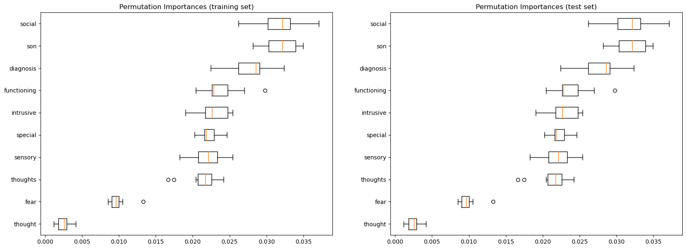

# Preprocessing and Analysis

Through the process of feature selection we settled on two primary methods within sklearn:

- SelectKBest
- PermuationImportance

The first of these was fairly intuitive while the second took more thought. The graphs below show the results of the PermuationImportance method. The first graph shows the results of the permutation importance for the top 10 features in the training set. The second graph shows the results of the permutation importance for the top 10 features in the test or validation set. These words are the most predictive of the target variable.

## Preprocessing

The preprocessing steps were fairly straightforward. We used the following steps:

- Remove punctuation via regex
- Lowercase words via the `.lower()` method
- Using `nltk` we removed stop words (english) from the selftext fields and replaced them with spaces.
- Using the censor_words function we removed our own custom stop words from the posts. These words were chosen based on the results of the permutation importance analysis and EDA.

### Censor Words Function

1. Lowercases the selftext passed into the function.
2. Removes all words that start with 'aut' or 'ocd' from the selftext field.
3. Remvoes all words that start with 'obsses' or 'compul' from the selftext field.
4. Removes all non-alphanumeric characters from the sentence and return the result
5. Removes all words that begin with 'high functioning' from the sentence and return the result

### Get Keywords Function
1. It takes a post as a parameter.
2. It makes an empty set of keywords.
3. It makes a list of words in the post by splitting the post text on any non-word character.
4. It loops over the list of words in the post.
5. For each word, it checks to see if the word is already in the set of keywords.
6. If it is not in the set of keywords, it adds it to the set of keywords.
7. It returns the set of keywords.

# Output from PreProcessing

The OCD thread spans a longer period of time than the Autism thread so, to reduce the chances of accidental leakage we decided to truncate the longer thread to the length of the shorter thread. This was done by cutting by UTC date. The output of the preprocessing steps is shown below.

Before removing posts before 1546777579 and after 1596525852, the total posts in the Autism dataframe is 25750, and the total posts in the OCD dataframe is 41449

Removed 20839 posts from OCD dataframe because they were outside of the time range
Dimensions after removing posts where `is_video` or `media_only` columns are True: (20544, 93) for OCD and (25540, 90) for Autism
Dimensions before dropping columns with more than 50% missing values: (20544, 93) for OCD and (25540, 90) for Autism
Dimensions after dropping columns with more than 50% missing values: (20544, 52) for OCD and (25540, 52) for Autism
columns in df_ocd: Index(['author', 'author_flair_richtext', 'author_flair_type', 'can_mod_post',
       'contest_mode', 'created_utc', 'domain', 'full_link', 'id',
       'is_crosspostable', 'is_reddit_media_domain', 'is_self', 'is_video',
       'link_flair_richtext', 'link_flair_text_color', 'link_flair_type',
       'locked', 'num_comments', 'num_crossposts', 'over_18',
       'parent_whitelist_status', 'permalink', 'pinned', 'retrieved_on',
       'score', 'selftext', 'spoiler', 'stickied', 'subreddit', 'subreddit_id',
       'subreddit_type', 'thumbnail', 'title', 'url', 'whitelist_status',
       'send_replies', 'no_follow', 'subreddit_subscribers',
       'is_original_content', 'pwls', 'wls', 'media_only', 'is_meta',
       'author_fullname', 'gildings', 'is_robot_indexable',
       'author_patreon_flair', 'all_awardings', 'total_awards_received',
       'allow_live_comments', 'awarders', 'target'],
      dtype='object')
Dimensions before dropping columns that are not in the lists above: (20544, 52) for OCD and (25540, 52) for Autism
Dimensions after dropping columns that are not in the lists above: (20544, 12) for OCD and (25540, 12) for Autism
Dropped the `is_video` and `media_only` columns
Median length of title and selftext columns combined for OCD: 643.0
Median length of title and selftext columns combined for Autism: 470.0
Acceptable number of OCD posts: 8786
Acceptable number of Autism posts: 9021
Dimensions before: (20544, 10) for OCD and (25540, 10) for Autism
Dimensions before: (8786, 10) for OCD and (9021, 10) for Autism
Number of authors in df_ocd: 3470
Number of authors in df_autism: 2897

# EDA Steps and Methods Used
1. read the data from the csv files into dataframes
2. create a target column for each dataframe
3. remove posts before 1546777579 and after 1596525852
4. drop rows where `is_video` or `media_only` columns are True
5. drop columns with more than 50% missing values from the dataframes
6. only keep the columns in these two dataframes that are in both dataframes and are in the lists above
7. drop columns that are not in the lists above
8. drop the `is_video` and `media_only` columns, which we don't need anymore.
9. combine the title and selftext columns into one column if they are long enough (threshold is 100 characters)
10. remove posts where the title and selftext combined are shorter than the median length of the title and selftext columns combined for each dataframe. This is to remove posts that are too short to be useful.
11. drop author_flair_richtext
12. how many authors are in each dataframe?
13. how many posts are there for the top 100 authors in each dataframe?
14. Drop the author_flair_type and author_fullname columns from both dataframes, these columns are not useful for our analysis.
15. Combine the title and self text columns into one column with the format `title - selftext` for each dataframe.
16. Drop the title and selftext columns for both dataframes, as we now have a single column with the title and selftext combined.
17. Rename the `title_selftext` column to `selftext` for both dataframes to maintain consistency.
18. Remove punctuation, numbers, and whitespace from the `selftext` column again to be sure that we have removed all of it.
19. Remove words from posts that are in the cancel_words list. There are regex patterns in the cancel_words list so we need to use the `regex=True` parameter in the `replace` method.
20. Remove double spaces from the `selftext` column, which may have been created by the `replace` method.
21. Make a new dataframe called df_reddit that combines the two dataframes into one dataframe.

### Dealing with Class Imbalance

1. Create a new dataframe with the same columns as the original dataframes
2. Check which dataframe is shorter
3. Add the shorter dataframe to the new dataframe
4. Shorten the longer dataframe to the length of the shorter dataframe
5. Add the shortened longer dataframe to the new dataframe.
6. Reset the index of the new dataframe.
7. Shuffle the new dataframe.
8. Check the dimensions of the new dataframe.

### Dealing with Medications
1. Read in the drug_info.csv file and convert the Medication Name column to lowercase
2. Create a list of the medications
3. Print the number of medications
4. Print the number of posts that contain a medication

The first line of code creates a list of the medications from the medications.csv file. This list is then used to find all of the medications in the selftext column of the dataframe.
After the medications are found, they are removed from the selftext column and the medications are added to a list of medications_mentioned. The medications_mentioned list is then used to create a list of medications to remove from the selftext column.This is done to ensure that the medications are removed from the selftext column even if they are written in a different way. For example, the medication "amphetamine" is written as "dextroamphetamine" in the selftext column. If the medications were not removed from the selftext column, the model would be able to learn that "dextroamphetamine" is a medication and would be able to predict that a post is about OCD if it contains the word "dextroamphetamine". This would be incorrect, as the post may not be about OCD, it may just be about a medication.

### Dealing with Stopwords
1. We first create a list of medications that are longer than 5 characters
2. We then create a list of rows and the medications mentioned in each row
3. We then create a new dataframe with this information
4. We then create a new column that counts the number of medications mentioned per row.
5. We then create a new dataframe that counts the number of medications mentioned per row

### Next

1. Load the data into a dataframe
2. Drop the column with constant values
3. Drop duplicate rows.
4. Create a new column that is the length of the selftext
5. Create a new column that is the number of words in the selftext
6. Create a new column for each letter of the alphabet that is the number of times that letter appears in the selftext
7. Save the data to a csv file.